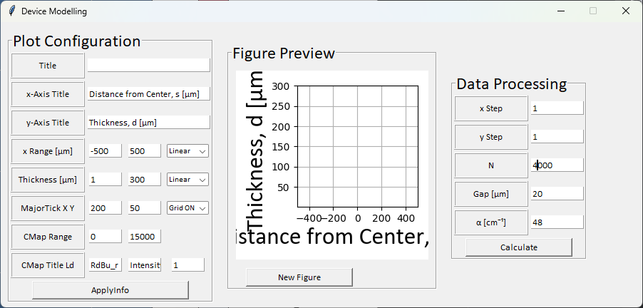
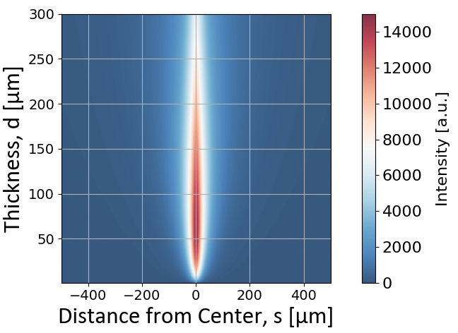
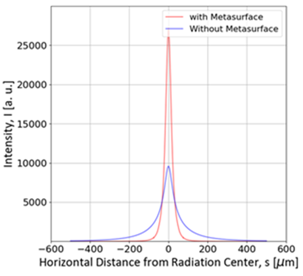

# Design-Scintillator
This Project Aims to Model Point Spread Function of Scintillator. 

---
### Assumptions

Generally, the Direction of Visible Light Generated from the Scintillator is Isotropic. Also, the Overall Structure of 
the Scintillator Layer is Spatially Homogeneous and Holds Symmetry. Therefore, Toy Model of the Spreading Light can be Calculated through
Convolution between Beer-Lambert Law as the Function of Penetrating Depth of X-Ray and Spherical Wave Function of the Visible Light.

- Assumption 1. Homogeneous and Symmetric Scintillator
- Assumption 2. Isotropic Radiation of the Visible Light from X-Ray Absorption.

---

### Modelling Function

```
PSF = Beer-Lambert Law * Intensity of Spherical Wave Function
```
- Beer Lambert Law, I(r) = I$_0$e$^{-\alpha r}$
- Spherical Wave Function, E(r, $\omega$) = A $\frac {e^{-j(\omega t-kr)}} {r}$


$$
\lim_{n\to\infty}
\sum_{k=1}^n AI_0\frac{e^{-\alpha kd/n}(1-e^{-\alpha d/n})} {r^2} 
$$

- For Discrete Case, below Calibration Factor might be added.

$$
\cos \theta=\frac{(d+g-kd/n)} {\sqrt{(d+g-kd/n)^2 +s^2 )}} 
$$

---

## How to Use?


### Insert Plot Configuration
1. Type title, x-axis, and y-axis title.
2. Type x-Range. These range define range of calculation.
3. Type Thickness range. These range are used for sweeping thickness.
4. Set MajorTick XY for setting interval tick of figure. This does not affect on the result.
5. Set CMap Range, CMap, and CMap title, respectively. This does not affect on the result.
6. If the Setting of Plot Configuration Parameters is Finished, Click New Figure Button in the Figure Preview Frame.  

### Data Processing Configuration
1. Set interval of x, y within the x-Range, y-Range, respectively.
2. Set N for calculation of convolution. Larger N is more accurate, but slower.
3. Set Gap between the end position of Scintillator and monitoring Position.
4. Set Attenuation Coefficients for the Scintillator.

### Result


- If the thickness of Scintillator layer is thin, Absorption is not sufficient and the intensity is smaller.
- As the thickness is increased, the point spread function is wider. This is likely to reduce MTF.

---

## Data Analysis

The Result is automatically copied to the clipboard. The data can be analyzed by preference of user. 
The below is one of example.

